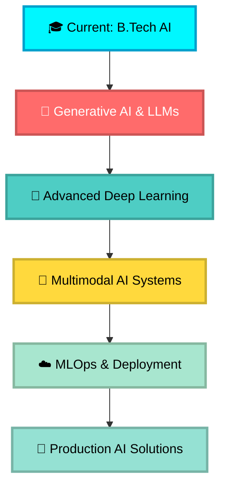

<div align="center">
  
<!-- Animated Header -->


<!-- Typing Animation -->


<!-- Social Badges with Glow Effect -->
<p align="center">
  <a href="https://www.linkedin.com/in/karan-singh-rathore-3b44242a7/">
    
  </a>
  <a href="mailto:karansrabcd@gmail.com">
    
  </a>
  <a href="https://github.com/karansrabcd01">
    
  </a>
  <a href="tel:+916268428912">
    
  </a>
</p>

<!-- Profile Views & Followers -->
<p align="center">
  
  
  
</p>

</div>

---

## 🚀 About Me


```python
class AIEngineer:
    def __init__(self):
        self.name = "Karan Singh Rathore"
        self.role = "AI Engineer & ML Specialist"
        self.location = "Durg, Chhattisgarh, India 🇮🇳"
        self.education = {
            "degree": "B.Tech (Honours)",
            "major": "CSE - Artificial Intelligence",
            "university": "CSVTU",
            "spi": "7.2/10",
            "year": "2023-2027"
        }
        self.current_status = "Building Tomorrow's AI Today"
        
    def current_focus(self):
        return {
            "🔭 working_on": ["Plant Disease Chatbot", "GenAI Projects"],
            "🌱 learning": ["Generative AI", "LLMs", "Advanced DL"],
            "🎯 goal": "Production-ready AI Systems",
            "⚡ fun_fact": "AI monk with trading mindset 🧘‍♂️📈"
        }
    
    def core_expertise(self):
        return [
            "🧠 Deep Learning & Neural Networks",
            "👁️ Computer Vision & Image Recognition",
            "💬 NLP & Large Language Models",
            "📊 Time Series & Predictive Analytics",
            "🤖 Generative AI & Transformers",
            "🚀 MLOps & Production Deployment"
        ]

    def call_to_action(self):
        print("💡 Open for collaborations on AI/ML projects!")
        print("🤝 Let's build something amazing together!")
        return "Connect with me ⬇️"

me = AIEngineer()
print(me.call_to_action())
```

> ### 💭 *"In the age of AI, we're not just coding the future—we're teaching machines to dream it."*

---

## 🔥 GitHub Stats & Streak

<div align="center">
  
<!-- GitHub Stats Cards -->


<!-- GitHub Streak Stats -->


<!-- Activity Graph -->


</div>

---

## 🏆 GitHub Trophies & Achievements

<div align="center">
  
<!-- Trophy Display -->


</div>

---

## 💼 Professional Journey

<table>
<tr>
<td width="33%" align="center">

### 🔬 Software Testing Intern
**Prakalp Vision**  
*Nov 2025 - Present*


✅ Cross-platform testing  
✅ Defect management  
✅ Feature demos  

</td>
<td width="33%" align="center">

### 🤖 AI Virtual Intern
**Infosys Springboard**  
*Sep - Oct 2025 (8 Weeks)*


🏆 Built Plant Disease System  
🎯 94% accuracy achieved  
⭐ Recognized for innovation  

</td>
<td width="33%" align="center">

### ☁️ AI Intern
**Microsoft Azure**  
*May - Jun 2025 (4 Weeks)*


🎯 95% accuracy (Face Mask)  
☁️ Cloud deployment  
🚀 ML pipelines  

</td>
</tr>
</table>

---

## 🛠️ Tech Arsenal

<div align="center">

### **🐍 Core Programming**


### **🤖 AI/ML Frameworks**


### **🧠 Deep Learning & Neural Networks**


### **💬 NLP & Language Models**


### **📊 Data Science & Visualization**


### **🚀 Development & Deployment**


### **💻 Tools & IDEs**


### **🌐 Web Development**


</div>

---

## 🚀 Featured Projects

<div align="center">

### 🌟 **Production-Grade AI Solutions** 🌟

</div>

<table>
<tr>
<td width="50%">

### 🌿 Plant Disease Prediction Chatbot
**Tech:** `TensorFlow` `CNN` `Transformers` `FastAPI` `React`

```python
accuracy = "94% (15+ diseases)"
architecture = "Multi-Model System"
features = [
    "🎯 Image Classification",
    "💬 Conversational AI",
    "📊 Real-time Dashboard",
    "🚀 Production API"
]
```

**Achievements:**
- ✅ 94% accuracy across 15+ disease categories
- ✅ Optimized CNN + Transformer integration
- ✅ FastAPI backend with React UI
- ✅ Real-time predictions & recommendations

<div align="center">


</div>

</td>
<td width="50%">

### 🌐 Real-Time Multilingual Voice Translator
**Tech:** `FastAPI` `LangChain` `WebSockets` `Groq` `Llama 3.1`

```javascript
const performance = {
  languages: "16+",
  latency: "<100ms",
  translation: "500ms avg",
  uptime: "99%+",
  model: "Llama 3.1"
}
```

**Achievements:**
- ✅ 16+ language support
- ✅ Sub-100ms latency (WebSocket)
- ✅ Groq API integration
- ✅ Production-ready web app

<div align="center">


</div>

</td>
</tr>
<tr>
<td width="50%">

### 📝 Customer Review Summarization System
**Tech:** `BERT` `TextRank` `Hugging Face` `NLTK`

**Impact Metrics:**
- ⏱️ **70% reduction** in processing time
- 📊 **High semantic** retention
- 💡 **Sentiment analysis** integration
- 🔄 **Dual pipeline** (Extractive + Abstractive)

```python
pipeline = {
    "extractive": "TextRank Algorithm",
    "abstractive": "BERT Transformer",
    "sentiment": "Polarity Classification",
    "output": "Actionable Insights"
}
```

<div align="center">

</div>

</td>
<td width="50%">

### 📈 Stock Market Trend Forecasting
**Tech:** `LSTM` `GRU` `Technical Analysis` `Time Series`

**Technical Indicators:**
```python
indicators = {
    "RSI": "Relative Strength Index",
    "MACD": "Moving Average Convergence",
    "BB": "Bollinger Bands",
    "MA": "Moving Averages (SMA/EMA)"
}
models = ["LSTM", "GRU"]
```

**Features:**
- 📊 Multi-horizon forecasting
- 🎯 Advanced feature engineering
- 📈 Interactive dashboards
- 💹 Trading signal interpretation

<div align="center">

</div>

</td>
</tr>
</table>

---

## 📊 Impact Metrics & Achievements

<div align="center">

<table>
<tr>
<td align="center" width="25%">

<br><br>
<strong>🚀 Completed Projects</strong>
<br>
<sub>End-to-end implementations</sub>
</td>
<td align="center" width="25%">

<br><br>
<strong>🎯 Model Performance</strong>
<br>
<sub>Production-grade accuracy</sub>
</td>
<td align="center" width="25%">

<br><br>
<strong>💼 Industry Experience</strong>
<br>
<sub>Microsoft | Infosys | Prakalp</sub>
</td>
<td align="center" width="25%">

<br><br>
<strong>🏆 Professional Certs</strong>
<br>
<sub>Coursera | Microsoft | Infosys</sub>
</td>
</tr>
</table>

</div>

---

## 🏅 Certifications & Recognition

<div align="center">

<table>
<tr>
<td width="50%" align="center">

### 🎓 Coursera
**Machine Learning Specialization**  
*Andrew Ng (2024)*


Comprehensive ML foundations  
Supervised & Unsupervised Learning  
Neural Networks & Deep Learning

</td>
<td width="50%" align="center">

### ☁️ Microsoft Azure
**AI Internship Certificate**  
*Edunet Foundation (2025)*


Azure ML Studio  
Computer Vision (95%+ accuracy)  
Cloud Deployment

</td>
</tr>
<tr>
<td width="50%" align="center">

### 💼 Infosys Springboard
**AI Virtual Internship**  
*Top Performer (2025)*


⭐ Recognition for Innovation  
🚀 Production Deployment  
🎯 94% Model Accuracy

</td>
<td width="50%" align="center">

### 🚀 ISRO
**Bhartiya Antariksh Hackathon**  
*Participant (2025)*


Space Technology Innovation  
AI/ML Applications  
National Level Competition

</td>
</tr>
</table>

</div>

---

## 📚 Learning Roadmap

<div align="center">



### 🎯 **Focus Areas 2025**

<table>
<tr>
<td align="center" width="33%">

### 🤖 Generative AI
- Large Language Models
- Prompt Engineering
- GANs & Diffusion Models
- Multimodal Learning

</td>
<td align="center" width="33%">

### 🚀 MLOps & Deployment
- Docker & Kubernetes
- CI/CD for ML
- Model Monitoring
- A/B Testing

</td>
<td align="center" width="33%">

### 🧠 Advanced Topics
- Reinforcement Learning
- Transfer Learning
- AutoML & NAS
- Edge AI & TinyML

</td>
</tr>
</table>

</div>

---

## 💡 Why Collaborate With Me?

<div align="center">

<table>
<tr>
<td width="33%" align="center">

### 🎯 **Problem Solver**


Strong foundation in algorithms  
Analytical thinking  
Creative solutions

</td>
<td width="33%" align="center">

### 🚀 **Fast Learner**


Quick adaptation  
Self-motivated  
Continuous improvement

</td>
<td width="33%" align="center">

### 🤝 **Team Player**


Excellent communication  
Collaborative mindset  
Knowledge sharing

</td>
</tr>
</table>

### 🌟 **Looking For:**

🤝 **Collaborations** on cutting-edge AI/ML projects  
💼 **Opportunities** in AI Engineering & Research  
🌱 **Mentorship** in advanced AI concepts  
🚀 **Open Source** contributions in ML/DL  
💡 **Innovation** challenges & hackathons

</div>

---

## 📈 Contribution Heatmap

<div align="center">


### 🔥 **Commit More, Achieve More!**


</div>

---

## 🎯 2025 Goals

<div align="center">

| Goal | Status | Progress |
|------|--------|----------|
| 🌿 Deploy Plant Disease Chatbot | 🚀 In Progress |  |
| 🌐 Complete 5 AI Projects | 🔄 Active |  |
| 📝 Publish Research Paper | 📚 Planning |  |
| 🏆 Win AI Hackathon | 🎯 Target |  |
| ⭐ Reach 100 GitHub Stars | 📈 Growing |  |
| 🤝 100+ Contributions | 💪 Active |  |

</div>

---

## 📊 Weekly Development Breakdown

<div align="center">

<!--START_SECTION:waka-->
```text
Python           12 hrs 30 mins  ███████████░░░░░░   55.2%
Jupyter Notebook  4 hrs 15 mins  ████░░░░░░░░░░░░░   18.8%
JavaScript        2 hrs 45 mins  ██░░░░░░░░░░░░░░░   12.1%
FastAPI           1 hr 30 mins   █░░░░░░░░░░░░░░░░    6.6%
Markdown          1 hr 15 mins   █░░░░░░░░░░░░░░░░    5.5%
Other             0 hrs 30 mins  ░░░░░░░░░░░░░░░░░    2.2%
```
<!--END_SECTION:waka-->

</div>

---

## 🎨 Latest Blog Posts

<!-- BLOG-POST-LIST:START -->
- 🌿 Building a Production-Ready Plant Disease Detection System
- 🤖 Introduction to Large Language Models: A Practical Guide
- 📊 Time Series Forecasting with LSTM & GRU Networks
- 💬 NLP Pipeline: From Text to Insights
<!-- BLOG-POST-LIST:END -->

---

## 💬 Connect & Collaborate

<div align="center">

### 🚀 **Let's Build Something Amazing Together!**

 <em><b>I love connecting with different people</b> so if you want to say <b>hi, I'll be happy to meet you more!</b> 😊</em>

<p align="center">
<a href="https://www.linkedin.com/in/karan-singh-rathore-3b44242a7/">
  
</a>
<a href="mailto:karansrabcd@gmail.com">
  
</a>
<a href="https://github.com/karansrabcd01">
  
</a>
<a href="tel:+916268428912">
  
</a>
</p>

### 📧 **Email:** karansrabcd@gmail.com
### 📱 **Phone:** +91 6268428912
### 📍 **Location:** Durg, Chhattisgarh, India

<br>


### ⚡ **Quick Response Time:** Within 24 hours!

<br>

</div>

---

## 🎯 Support My Work

<div align="center">

**If you like my work, consider:**

⭐ **Starring** my repositories  
🔔 **Following** me on GitHub  
💬 **Sharing** my projects  
🤝 **Contributing** to open source  
📧 **Reaching out** for collaborations  

<br>


### 💖 **Thank you for visiting my profile!**


</div>

---

<div align="center">

### 📊 Profile Stats


<br>


**Made with ❤️ by Karan Singh Rathore**

<sub>Last Updated: December 2024</sub>

</div>
