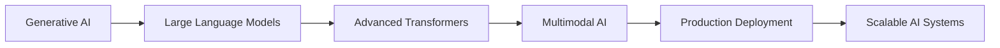

<div align="center">
  
# 👋 Hi, I'm Karan Singh Rathore

### 🤖 AI Engineer | Machine Learning Enthusiast | Deep Learning Specialist

[](https://www.linkedin.com/in/karan-singh-rathore-3b44242a7/)
[](mailto:karansrabcd@gmail.com)
[](https://github.com/karansrabcd)
[](#)


</div>

---

## 🚀 About Me

```python
class AIEngineer:
    def __init__(self):
        self.name = "Karan Singh Rathore"
        self.role = "AI Engineer & ML Specialist"
        self.location = "Durg, Chhattisgarh, India 🇮🇳"
        self.education = "B.Tech (Hons) in CSE - Artificial Intelligence"
        self.university = "Chhattisgarh Swami Vivekananda Technical University"
        
    def current_focus(self):
        return {
            "learning": ["Generative AI", "LLMs", "Advanced Deep Learning"],
            "working_on": ["Plant Disease Prediction Chatbot", "AI-powered Solutions"],
            "interests": ["Computer Vision", "NLP", "Time Series Forecasting"],
            "goal": "Building scalable, production-ready AI systems"
        }
    
    def specializations(self):
        return [
            "🧠 Deep Learning & Neural Networks",
            "👁️ Computer Vision & Image Processing",
            "💬 Natural Language Processing & LLMs",
            "📊 Time Series Analysis & Forecasting",
            "🤖 Generative AI & Transformers",
            "🔄 End-to-End ML Pipeline Development"
        ]
```

> *"Aspiring to be the AI monk with the trading mind of innovation"* 🧘‍♂️📈

---

## 💼 Professional Experience

<table>
<tr>
<td width="50%">

### 🔬 Software Testing Intern
**Prakalp Vision** | *Nov 2025 - Present*
- Cross-platform testing & QA automation
- Test documentation & defect management
- Feature demo production

</td>
<td width="50%">

### 🤖 AI Virtual Intern
**Infosys Springboard** | *Sep - Oct 2025*
- Built Plant Disease Detection System
- CNN + Transformer-based NLP integration
- Top-performing intern recognition

</td>
</tr>
<tr>
<td width="50%">

### ☁️ AI Intern
**Microsoft Azure** | *May - Jun 2025*
- Azure ML Studio deployment
- Computer Vision models (95%+ accuracy)
- Cloud-based ML pipelines

</td>
<td width="50%">

### 🎓 Continuous Learning
**Self-Driven Projects**
- Real-time ML systems
- Production-grade APIs
- Research & Innovation

</td>
</tr>
</table>

---

## 🛠️ Tech Stack & Skills

### **Core AI/ML**


### **Deep Learning Architectures**


### **NLP & Generative AI**


### **Data Science & Analytics**


### **Development & Deployment**


### **Programming Languages**


### **Web Technologies**


---

## 🚀 Featured Projects

### 🌿 [Plant Disease Prediction Chatbot](https://github.com/karansrabcd)
**Tech Stack:** `TensorFlow` `CNN` `Transformers` `FastAPI` `React`

```python
# Project Highlights
accuracy = "94% across 15+ disease categories"
architecture = "Multi-model: CNN + Conversational AI"
deployment = "Production-ready API with real-time predictions"
```

**Key Features:**
- 🎯 Optimized CNN architecture achieving 94% accuracy
- 💬 Transformer-based chatbot for user interaction
- 🚀 FastAPI backend with responsive React dashboard
- 📊 Real-time disease prediction and treatment recommendations

---

### 🌐 [Real-Time Multilingual Voice Translator](https://github.com/karansrabcd)
**Tech Stack:** `Python` `FastAPI` `LangChain` `WebSockets` `Groq API` `Llama 3.1`

```javascript
const performance = {
  languages: "16+ supported",
  latency: "<100ms (WebSocket communication)",
  translation_time: "500ms average",
  uptime: "99%+"
};
```

**Key Features:**
- 🎙️ Real-time bidirectional voice translation
- ⚡ Sub-100ms latency with WebSocket architecture
- 🤖 Groq's Llama 3.1 integration for high-quality translation
- 🌍 Support for 16+ global languages

---

### 📝 [Customer Review Summarization System](https://github.com/karansrabcd)
**Tech Stack:** `BERT` `TextRank` `Hugging Face` `NLTK` `Transformers`

**Impact Metrics:**
- ⏱️ 70% reduction in manual review processing time
- 📊 High semantic retention in summaries
- 💡 Sentiment polarity classification for business insights
- 🔄 Extractive + Abstractive summarization pipeline

---

### 📈 [Stock Market Trend Forecasting System](https://github.com/karansrabcd)
**Tech Stack:** `LSTM` `GRU` `scikit-learn` `Technical Analysis` `Time Series`

```python
# Technical Indicators Implemented
indicators = ["RSI", "MACD", "Bollinger Bands", "Moving Averages"]
models = ["LSTM", "GRU"]
features = "Advanced feature engineering from technical indicators"
visualization = "Interactive real-time dashboard"
```

---

## 📊 GitHub Analytics

<div align="center">
  


</div>

---

## 🏆 Certifications & Achievements

<table>
<tr>
<td width="50%">

🎓 **Machine Learning Specialization**  
*Coursera - Andrew Ng (2024)*

🏅 **AI Internship Certificate**  
*Microsoft Azure Edunet Foundation (2025)*

</td>
<td width="50%">

🏅 **AI Internship Certificate**  
*Infosys Springboard (2025)*

🚀 **Participant**  
*Bhartiya Antariksh Hackathon - ISRO (2025)*

</td>
</tr>
</table>

### 🌟 Recognition
- ⭐ **Top-Performing Intern** at Infosys Springboard for innovation and practical deployment
- 🏆 Face Mask Detection System: **95%+ accuracy** on real-time video feeds
- 📈 Successfully deployed **production-ready AI solutions** with FastAPI

---

## 📚 Current Learning Journey



**Focus Areas:**
- 🧠 Advanced Deep Learning Architectures
- 🤖 LLMs & Prompt Engineering
- 🎨 Generative AI Models (GANs, Diffusion Models)
- 🔄 MLOps & Model Deployment
- ☁️ Cloud-based AI Solutions
- 📊 AI System Optimization

---

## 💡 What I'm Looking For

- 🤝 **Collaboration** on cutting-edge AI/ML projects
- 💼 **Opportunities** in AI Engineering and Research
- 🌱 **Mentorship** in advanced AI concepts
- 🚀 **Open Source** contributions in ML/DL

---

## 📫 Let's Connect!

<div align="center">

**Open to opportunities, collaborations, and interesting AI conversations!**

[](https://www.linkedin.com/in/karan-singh-rathore-3b44242a7/)
[](mailto:karansrabcd@gmail.com)
[](https://github.com/karansrabcd)

</div>

---

<div align="center">
  
### 💭 *"In the age of AI, we're not just coding the future—we're teaching machines to dream it."*


**⭐ If you find my work interesting, consider giving my repositories a star!**

</div>

---

<div align="center">
  
</div>
